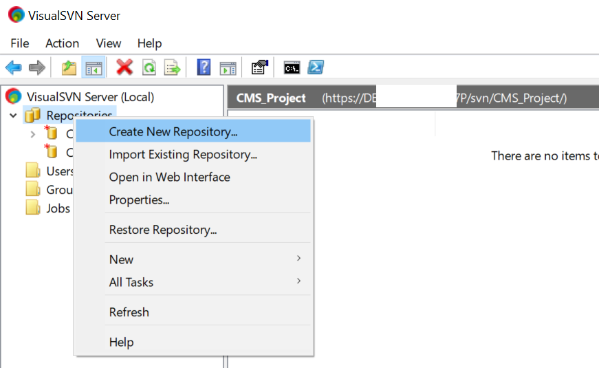
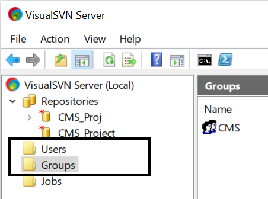
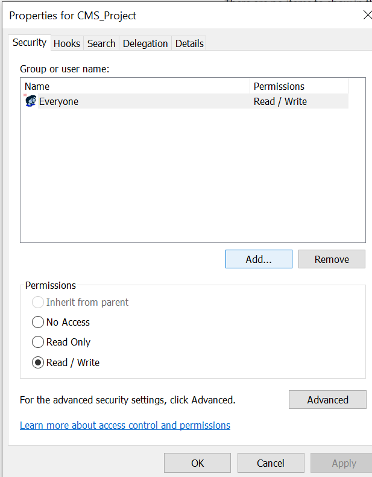
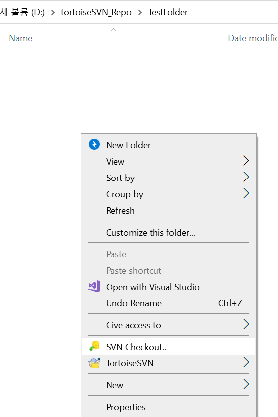
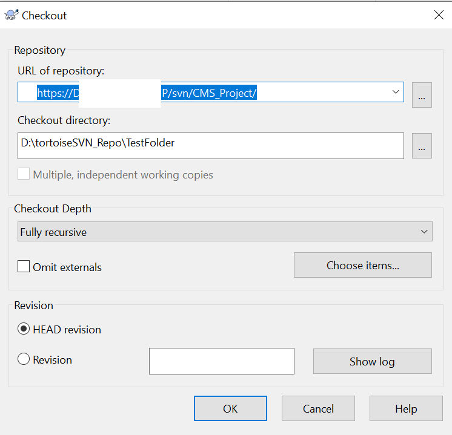

# SVN_Tutorial
 
준비물 : Visual SVN Server / Tortoise SVN

## VisualSVN

~~~~
1. Visual SVN Server를 설치한다. (링크 : https://www.visualsvn.com/downloads/)
~~~~

~~~~
2. 실행하고 Repository를 만들어준다.
~~~~

~~~~
3. User / Group을 생성한다. (선택임. 로컬에서만 사용한다면 굳이 할 필요는 없음.)
~~~~

~~~~
4. 생성한 Repository의 Properties에 들어가서 Group을 ADD한다. (선택임. 로컬에서만 사용한다면 굳이 할 필요는 없음.)
5. 생성한 Repository를 확인한다.
~~~~

## Tortoise SVN

~~~~
1. Tortoise SVN을 설치한다.
~~~~

~~~~
2. 빈 폴더를 만들고, 빈 폴더에서 위에 Visual SVN Server로 만든 Repository URL을 입력하여 SVN Checkout을 한다.
3. Tortoise SVN의 Commit 기능으로 SVN에 Commit될 필요가 없는 폴더 및 파일을 (언리얼 엔진을 예시로 들자면 Saved, Intermediate, DerivedDataCache 등) Ignore 처리한다.
4. 필요한 데이터들은 Add한다.
~~~~

### 이후 사용법
다른 컴퓨터에서 추가되거나 수정된 파일이 존재하면 오른쪽 클릭하고 SVN Update를 한다.
Ignore는 SVN Commit에서도 할 수 있다.

다른 컴퓨터에서도 Repository URL을 알 수 있다면 Clone , Commit, Update들을 할 수 있다.
다만, 기본 URL이 ip가 아니라 컴퓨터 명칭이고, 포트 포워딩 등의 작업을 해야하고.. 보안 문제 때문에 잘 생각하고 해야한다.

Visual SVN Server로 만든 Repository는 로컬에서 TortoiseSVN으로 해당 Repository안에서 Checkout으로 새 Repository를 만드는 행위는 하지 않도록 주의해야한다.
TortoiseSVN으로 Repository를 생성하면서 .svn 폴더와 데이터가 생성되고, db 폴더에 재귀적으로 저장되어 프로젝트 크기가 미치도록 커진다.
생성한 Server는 VisualSVN Manager 이외엔 외부에서 건드리지 않도록 하자.

나중에 관리하기 쉽도록 큰 에셋들을 한번에 다 Add하지 말고 적당한 양으로 분할해서 Add하자.
한번에 다 Add하면 db 리비전 n에 전부 그 에셋들이 저장되므로 나중에 db의 해당 리비전 파일이 손상되면 문제가 생길 가능성이 있음.
예시) 리비전 1에 100GB 에셋을 전부 저장하면 리비전 1 db 용량이 100기가임. 

VDFS(VisualSVN Distributed File System)로 만들면 백업용 서버 개념으로 사용이 가능하지만, 컴퓨터 여러 대가 준비되어야 할 것이니 다루지 않음.
기본으로 사용하다가 해당 리포지토리 컴퓨터가 터지면 SVN 사용이 불가능하고, 복구 불가능 상태가 되면 새로 만들어야함.
